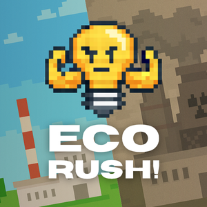

  

<h1 align="center">ECORUSH!</h1>

  
  
  
  
  
  
    

  ECORUSH! es un videojuego educativo en 2D con estética pixel art, desarrollado en Python y Pygame. Este proyecto nace como una iniciativa académica para la Facultad de Ingeniería Electromecánica de la Universidad de Colima, con el fin de abordar de manera interactiva el Objetivo de Desarrollo Sostenible 13 (ODS 13): Acción por el Clima.
  El juego está diseñado para concientizar a jugadores jóvenes (6-12 años) sobre la crisis climática, demostrando cómo las acciones diarias de consumo de energía impactan directamente en el medio ambiente.

---
## 🔧 Mecánica Principal
La premisa del juego es un reto de gestión de tiempo y recursos. El jugador elige un personaje (niño o niña) y debe recorrer una casa para apagar luces, cerrar llaves de agua y apagar aparatos electrónicos que están desperdiciando energía.

El jugador debe completar esta tarea antes de que se acabe el tiempo del reloj.

Para añadir un desafío, el personaje tiene una barra de energía que se consume al moverse y baja aún más rápido al correr. La única forma de rellenar esta barra es interactuando con los dispositivos para ahorrar energía, creando una metáfora directa: "ahorrar energía te da más energía para seguir".

El jugador pierde si el tiempo llega a cero o si su barra de energía se agota por completo.

## 📋 Objetivos generales
Diseñar y aplicar un videojuego educativo enfocado en la ODS 13 (Acción por el clima), el videojuego no solo busca entretener, sino también concientizar, informar y despertar un compromiso real con la acción por el clima, contribuyendo a formar ciudadanos responsables con el planeta.

## 📋 Objetivos específicos

* **Diseñar** un videojuego educativo que integre contenidos relacionados con la ODS 13 y el cambio climático.
* **Sensibilizar** a los jugadores sobre las causas y consecuencias del cambio climático mediante dinámicas interactivas.
* **Promover** hábitos responsables con el medio ambiente a través de retos y misiones dentro del videojuego.
* **Fomentar** la reflexión crítica sobre la importancia de la acción climática en la vida cotidiana.
* **Evaluar** el impacto del videojuego en la adquisición de conocimientos y actitudes ambientales en los usuarios.

## 🛠️ Herramientas Utilizadas

* Python
* Pygame
* OpenCV
* LibreSprite
* Canva

## 🎮 Controles

| Acción | Tecla |
| :--- | :--- |
| Moverse | W, A, S, D |
| Correr | Shift |
| Interactuar | E |
